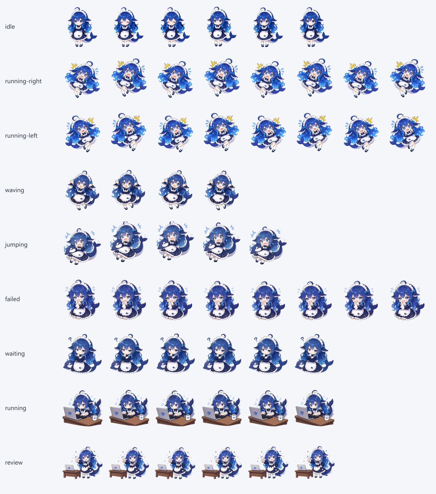

# Codex 桌宠 · DeepSeek Whale

把 [keleus/deepseek-pet](https://github.com/keleus/deepseek-pet) 的蓝鲸女仆角色
做成 **Codex 桌面端原生桌宠**，开箱即用。


> **非官方粉丝作品**，与 DeepSeek、OpenAI 均无关联。
> 素材来源与许可见 [NOTICE.md](./NOTICE.md)。

## 为什么需要重制

上游项目是 **DeepSeek Harness 的 Web 插件**：它通过 `@deepseek-ai/dsh-client-ui-*`
这套 DSH 专用接口向浏览器 DOM 注入 React 组件，并读取 `uiConversation`、
`uiSession`、`uiWorkspace` 等 DSH 内部服务。Codex 桌面端没有这套接口，
也没有加载第三方 Web UI 的扩展点，**原插件无法直接装进 Codex**。

不过 Codex 自带桌宠系统并支持自定义宠物，格式是一张静态雪碧图。
本项目把上游的 30 张姿势素材重新合成为符合该格式的图集。

## 安装

### 方式一：一条命令（Windows PowerShell）

```powershell
git clone https://github.com/voyid/codex-pet-deepseek-whale.git
cd codex-pet-deepseek-whale
./install.ps1
```

### 方式二：一条命令（macOS / Linux）

```bash
git clone https://github.com/voyid/codex-pet-deepseek-whale.git
cd codex-pet-deepseek-whale
./install.sh
```

### 方式三：手动复制

把 `pets/deepseek/` 整个目录复制到：

| 系统 | 目标路径 |
| --- | --- |
| Windows | `%USERPROFILE%\.codex\pets\deepseek\` |
| macOS / Linux | `~/.codex/pets/deepseek/` |

装好后在 **Codex → 设置 → Pets** 里选择 **DeepSeek Whale**。
若列表里没出现，重启 Codex 或刷新窗口。

## 效果

静态图集总览（每行一个动作）：



| 行 | 动作 | 帧数 | 说明 |
| --- | --- | --- | --- |
| 0 | idle | 6 | 呼吸 + 眨眼，静止时循环 |
| 1 | running-right | 8 | 向右移动 |
| 2 | running-left | 8 | 向左移动 |
| 3 | waving | 4 | 挥手 |
| 4 | jumping | 5 | 鼠标悬停时的跳跃 |
| 5 | failed | 8 | 出错 |
| 6 | waiting | 6 | 等待你确认 / 输入 |
| 7 | running | 6 | 正在执行任务 |
| 8 | review | 6 | 查看结果 |
| 9-10 | look ×16 | 16 | 朝鼠标方向的 16 向视线 |

其余细节（点击切换动作）见 [preview.html](./preview.html)，用浏览器直接打开即可
（该页面引用 `pets/deepseek/spritesheet.png`，请一并保留目录结构）。

## 技术格式

Codex 自定义宠物的格式：

```
%USERPROFILE%\.codex\pets\<名字>\
├── pet.json
└── spritesheet.png
```

- 图集：`1536×2288`，8 列 × 11 行，单元格 `192×208`，带透明通道
- 清单：`spriteVersionNumber: 2`（决定 11 行布局与 16 向视线）
- 第 0-8 行是标准动作，未使用的格子必须完全透明；第 9-10 行是 16 个顺时针视线方向

本项目的图集已按该规则校验通过。

## 重新生成

需要 Node.js 18+ 与 `sharp`。

```bash
npm install sharp
node tools/fetch-upstream-assets.mjs   # 从上游仓库拉取素材
node tools/build-atlas.mjs             # 合成图集
node tools/validate-atlas.mjs pets/deepseek/spritesheet.png
```

## 关于动画的说明

上游素材只有 **静态姿势**，没有逐帧动画。因此各行的多帧动画是在静态图上做
呼吸、摆动、挤压、位移等几何变换合成出来的，**不是逐帧手绘**。
其中左右移动使用了带闪电符号的惊吓姿势，读起来更像「慌张地窜」而不是真正的跑步。
想要更自然的动作，需要用 AI 逐帧重绘整行素材。

## 许可与署名

| 范围 | 许可 | 版权 |
| --- | --- | --- |
| 角色图像素材与图集 | MIT（承自上游） | © 2026 keleus 及上游贡献者 |
| 本仓库的脚本与文档 | MIT | © 2026 本仓库作者 |

上游：[keleus/deepseek-pet](https://github.com/keleus/deepseek-pet)（MIT），
固定于 commit `65d02e1`。许可全文见 [LICENSE-upstream](./LICENSE-upstream)。

**商标**：`DeepSeek` 及角色上的蓝鲸标识属于杭州深度求索；`Codex`、`OpenAI`
属于 OpenAI。MIT 不授予商标权，本项目对其使用仅为指明来源，不代表任何关联或背书。

详见 [NOTICE.md](./NOTICE.md)。

---

## English

A Codex desktop **custom pet** built from the character art of
[keleus/deepseek-pet](https://github.com/keleus/deepseek-pet).

The upstream project is a DeepSeek Harness web plugin and cannot be installed into
Codex. Codex ships its own pet system with support for custom pets, so this project
re-composes the upstream artwork into the required `1536x2288` (8x11, `192x208` cells)
atlas.

**Install:** copy `pets/deepseek/` to `~/.codex/pets/deepseek/`, then pick
**DeepSeek Whale** under *Settings → Pets*.

**Artwork** originates from the upstream repository (MIT, © 2026 keleus and contributors)
and is redistributed under the same license; see [LICENSE-upstream](./LICENSE-upstream)
and [NOTICE.md](./NOTICE.md). Scripts and docs here are MIT licensed.

Unofficial fan project. Not affiliated with or endorsed by DeepSeek or OpenAI.
The upstream artwork is static, so animation frames are procedurally derived from
single poses rather than hand-drawn.
